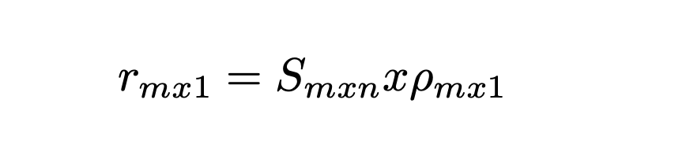
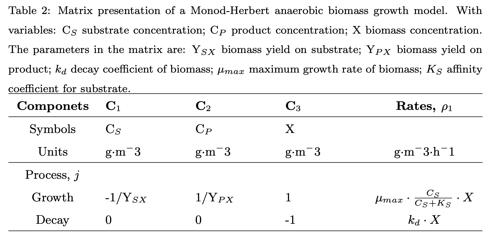

Artificial Intelligence
=========

Matrix notation uses the linear relations among net conversion rates in order to describe the conservation relations inside a system and it is is a well established system to mathematically describe complex models.
The description of a system through this methodology is done by defining its number of components n, and its number of processes m. This is the foundation for the stoichiometric matrix, S, the process rate vector, ρ, and finally, the component conversion rate vector r.

================================

================================

================================

The overall component conversion rate vector (r) is then coupled to a general mass balance equation.
