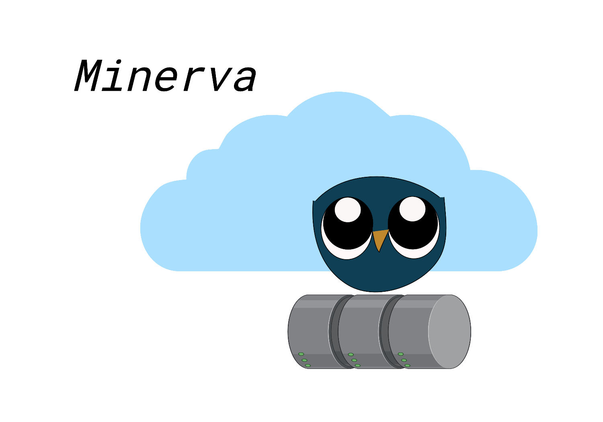
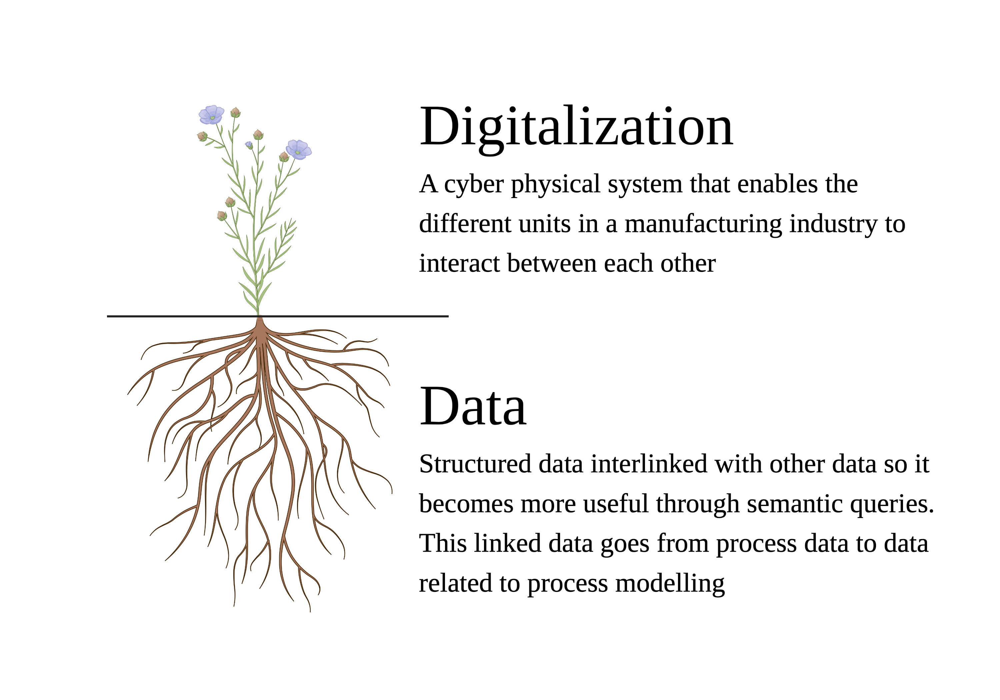

.. Simo documentation master file, created by
   sphinx-quickstart on Wed Oct 28 09:45:38 2020.
   You can adapt this file completely to your liking, but it should at least
   contain the root `toctree` directive.

Minerva: An Open-Source Library for Bioprocesses
=========================================================================

Minerva is a relational database with (i) bio-kinetic models; (ii) process and modeling information; (iii) and an expert system.

Key Features & Capabilities
---------------------------
* **Fast and flexible.** 
  Minerva have basic building blocks to design and simulate a bioprocess. 

* **Understandable data.**
  The data is collected in an open standard file format, called JSON. It uses human-readable text to store and transmit data. 

* **Standarized construction of models.**
  The evaluation of thousands of biorefinery designs is streamlined through smart and efficient management of biorefinery parameters to evaluate sets of design decisions and scenarios.

* **Accesible for all and to all.**
  Several first principle models are inside this database. Some of the most importants are: the aerobic growth of Saccharomyces cerevisia or Escherichia coli or the anaerobic growth of Mannheimia succiniciproducens.

Why we do this...
-----------------------------

================================

How we do this...
-----------------------------

.. image:: graphics/Ontology_v1.png
================================

.. toctree::
   :maxdepth: 2
   :caption: Contents:

   model-library
   parameter-library
   problem-library
   theory-library

.. toctree::
   :maxdepth: 2
   :caption: Methods:

   MatrixNotation
   MongoDB
   Json
   Python

.. toctree::
   :maxdepth: 2
   :caption: Applications:

   Software-integration
   AI

Indices and tables
==================

* :ref:`genindex`
* :ref:`modindex`
* :ref:`search`
